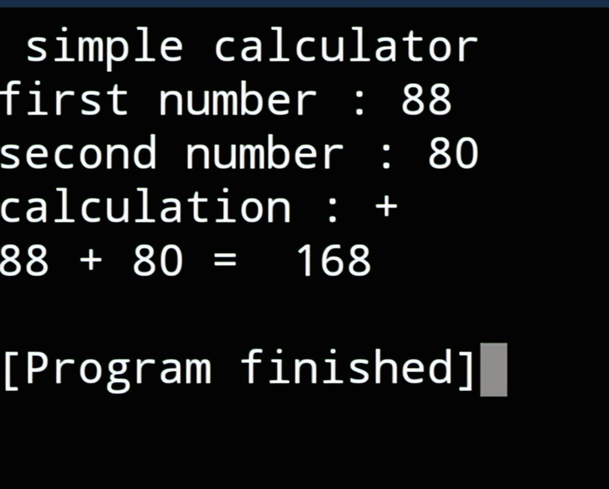

#  Python Calculator

This is a simple calculator built using Python.

---

## Example Output

---

## 🚀 Features
- Addition
- Subtraction
- Multiplication
- Division

---

## 🧠 What I Learned
- Python basics
- If-else conditions
- User input handling

